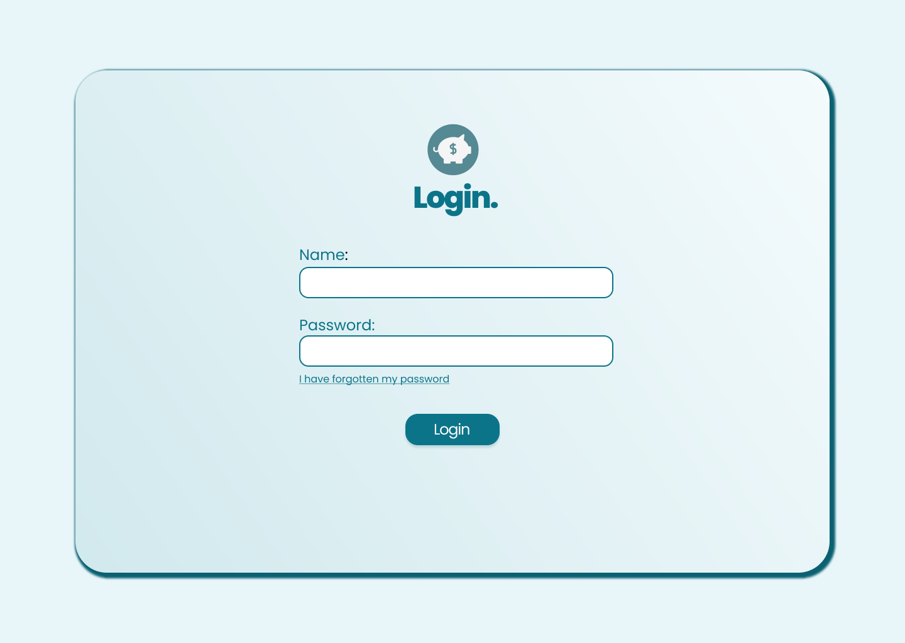
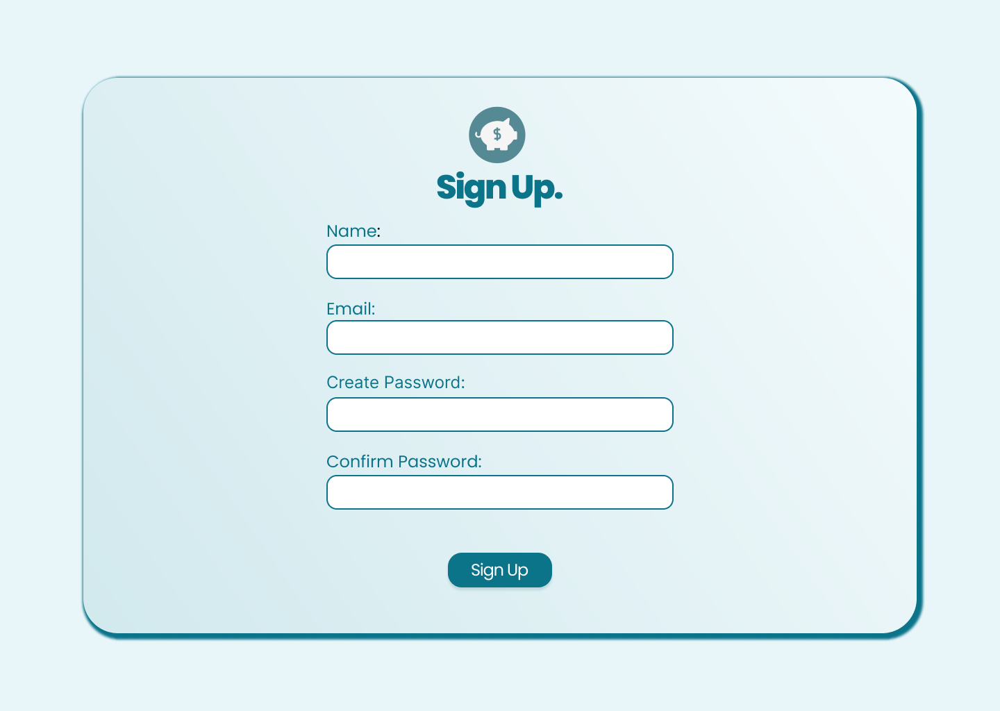
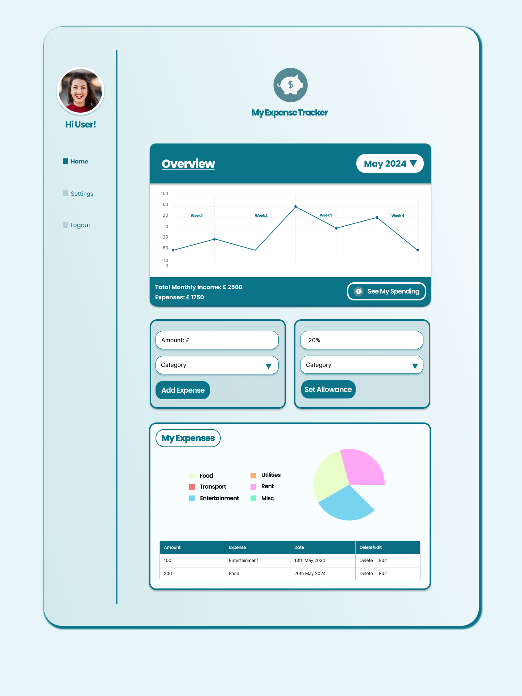

# My Expense Tracker - Team 35 Project

This is to serve as a log of what has been done so far and can be used as part of our final report. I have tried to explain what has been done so far.

## Features

- Allow users to sign up/login to their own dashboard.
- Allow users to add an expense.
- Allow users to set a maximum spend per category.
- Allow users to see summary of spending and suggestions of which category they are spending the most on. (Popup Modal)
- Allow users to view their total spending by month in Line Chart format. (Maybe this could be interactive?).
- Allow users to view their total spending by month in Pie Chart format and Table view.

## MockUp/Design

Here are the Mockup's/Designs for the App:

Home Page:

Login Page:

SignUp Page:

User Dashboard:

Popup Modal:

Settings Page:

## Tasks Completed

- Setup of the frontend.
- Created routes for the app.
- Created the basic structure of each component, these are all located in the components folder.
- Defined some custom css variables in both the tailwind.config file and main.css file.
- Installed Jest for developement testing.
- Assets folder created with Logo and a separate folder for mockups.

## Running the app (Development)

To run the app:

- initialise git (git init)
- clone the repository to your local machine. (git clone {URL})
- install all of the dependancies (npm install OR yarn install)
- run the app in dev mode (npm run dev OR yarn run dev)
